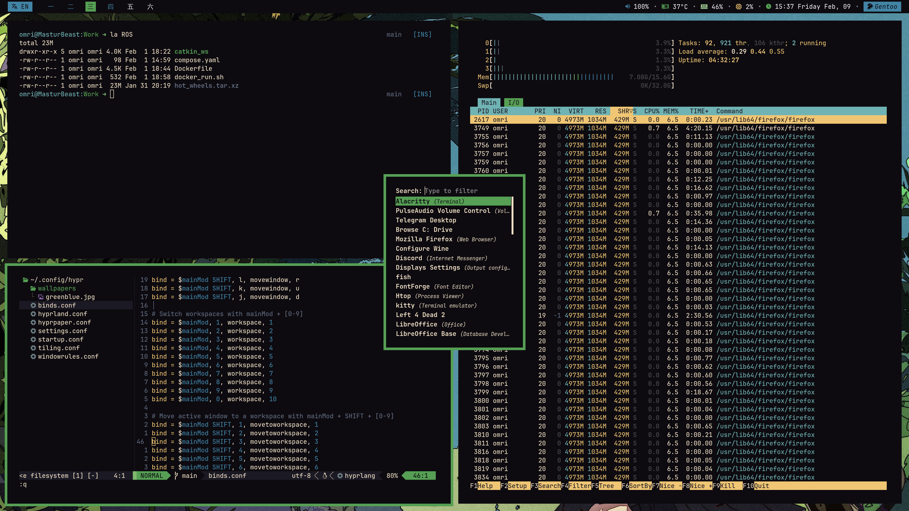

# My main dots

## Warning
I use this branch to specifically backup config of my current PC. 
It probably won't work on your PC.

## Overview
My dots for bspwm PC setup. A good half is shamelessly stolen from [phuocn0302](https://github.com/phuocn0302/dotfiles). Kudos to open source!

## What's inside?
This repo includes dots for:
- [x] alacritty
- [x] bspwm
- [x] sxhkd
- [x] [nvim (submodule)](https://github.com/OMRIFIJI/nvim-cfg)
- [x] ~~anime wallpaper~~
- [x] polybar
- [x] rofi
- [x] zsh
- [x] gtk
- [x] custom desktop entries

## How to install?
I switched to [GNU Stow](https://www.gnu.org/software/stow/stow.html)
to manage my dots with symlinks. It allows to have version control in a subdirectory of home rather than home itself.
Installing dots with GNU Stow is as easy as:
1. `git clone --recursive https://github.com/OMRIFIJI/dots-bspwm.git`
2. `cd dots-bspwm`
3. `stow .`

## Dependencies
- Nvim setup needs [Nerd Fonts](https://www.nerdfonts.com)
- Polybar also needs [Nerd](https://www.nerdfonts.com) and [Font Awesome Free](https://fontawesome.com)

## Screenshots

## Task list
- [ ] Better color management
- [ ] Learn how to exit vim

## Wallpaper
Check out [source](https://www.pixiv.net/en/artworks/59810770) on pixiv.
